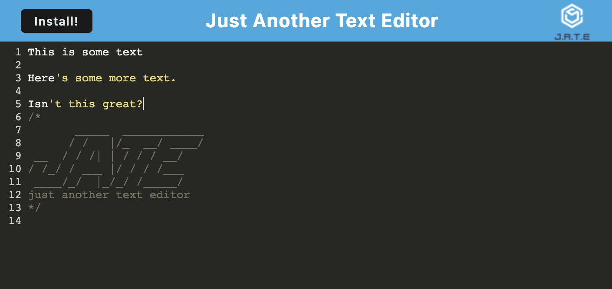

# PWA Text Editor

## Table of Contents

- [Description](#description)
- [Installation](#installation)
- [Usage](#usage)
- [Technologies](#technologies)
- [Questions](#questions)

Use the app [here!](https://eschindev-pwa-text-editor.herokuapp.com/)

## Description

A small text editor app that leverages IndexedDB to retain data previously entered on the same client machine

## Installation

Clone the repo, cd into it, run 'npm run start' to build the front end and start a localhost server, navigate to indicated localhost port to use

## Usage

This app can be used in the browser, or installed as a standalone PWA for offline use

## Technologies

- Node.js
- Webpack
- Workpack
- Express.js
- Babel loader
- Style loader

## Questions

[My GitHub Profile](https://github.com/eschindev)

[Email me!](mailto:eschindler1993+dev@gmail.com)
